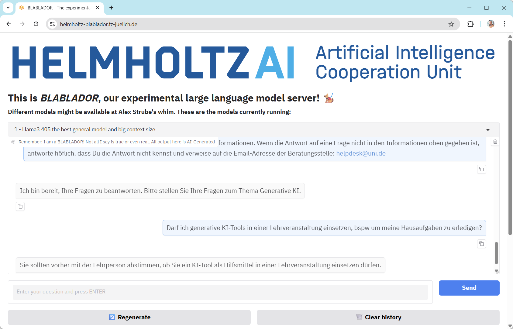
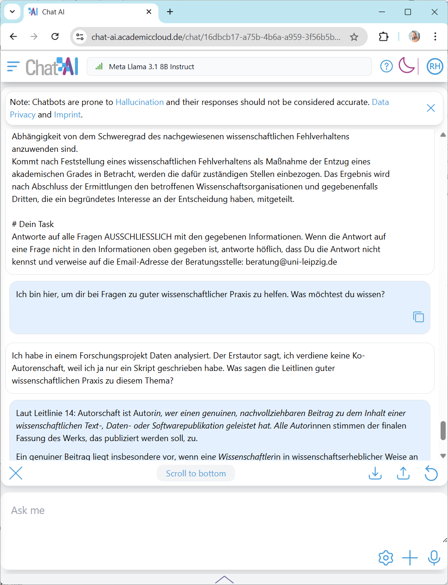
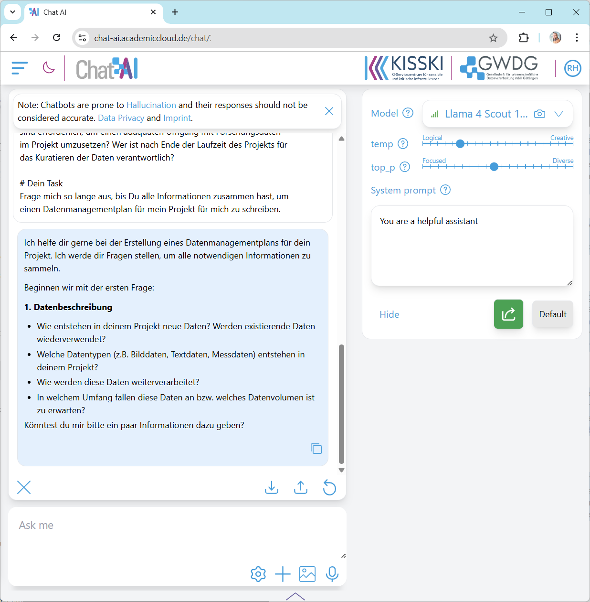

# Erstellen eines eigenen Chatbots

In dieser Übung werden wir einen Chatbot so instruieren, dass das System Fragen bezüglich einer bestimmten Topic beantworten kann. Wir können dann das System mit vorhandenen Chatbots zum gleichen Thema vergleichen.

## Die Aufgabe

Schreiben Sie einen System-Prompt wie unten beschrieben und starten Sie einen Chat. Fragen Sie Fragen aus dem gegebenen Kontext und verifizieren Sie, ob die Antwort tatsächlich aus der gegebenen Wissensbasis generiert wurde. Fragen Sie auch nach Themen außerhalb des Themengebiets: Kann der auf Gute Wissenschaftliche Praxis spezialisierte Chatbot Kochrezepte schreiben? Kann ein Chatbot, der auf Datenmanagementpläne spezialisiert ist, auch Auskunft zu regionalen Ausflugszielen geben?

## So geht's

Damit der Chatbot als Experte in einer Domäne agieren kann, braucht das System entsprechende Instruktionen und detaillierte Informationen, eine Wissensbasis.

```
Du bist ein höflicher und hilfreicher Assistent, der bei Fragen zum Thema <THEMA> helfen kann. 
Du hast folgende Informationen zur Verfügung:

<INFORMATIONEN>

# Dein Task

Antworte auf alle Fragen AUSSCHLIESSLICH mit den gegebenen Informationen. 
Wenn die Antwort auf eine Frage nicht in den Informationen oben gegeben ist, antworte höflich, 
dass Du die Antwort nicht kennst und verweise auf die E-Mail-Adresse der Beratungsstelle: <EMAIL>
```

Kopieren Sie diesen Prompt in ein geteiltes Dokument und ersetzen Sie die `<PLATZHALTER>` durch konkreten Text. Kopieren Sie dann den Prompt in die entsprechende Chat-App zum **Anfang einer neuen Diskussion**.

## Themen

Für diese Übung stehen verschiedene Themen zur Auswahl.
* [Nutzung von Generativer KI](nutzung_genki.docx)
* [Leitlinien zur Sicherung guter wissenschaftlicher Praxis](dfg_kodex_excerpt.docx)
* [Checkliste zum Umgang mit Forschungsdaten](checkliste_dmp.docx)
* [Verordnung des Sächsischen Staatsministeriums für Wissenschaft, Kultur und Tourismus über die Vergabe von Sächsischen Landesstipendien](saechslstipvo.docx)
* Nutzen Sie ggf. auch in der Übung zuvor generierte Wissensbasen

## KI-Systeme

Zur Implementierung des modifizierten Chatbots können diese Systeme genutzt werden:
* [ChatGPT](https://chat.openai.com/)
* [Claude](https://claude.ai)
* [Gemini](https://gemini.google.com/app)
* [GWDG Kisski Chat AI (Academic Cloud)](https://chat-ai.academiccloud.de/)
* [Helmholtz Blablador](https://helmholtz-blablador.fz-juelich.de/)

## Hinweise

Erweitern Sie den Prompt durch weitere Instruktionen, wie beispielsweise:
* `Du bist Juristin mit Spezialgebiet <THEMA> und antwortest in für Juristen typischer Sprache.`
* `Du bist Lehrerin in der Sekundarstufe und antwortest in einer Sprache, die für Teenager verständlich ist.`
* `Die Antworten müssen SUPER exakt und idealerweise wörtliche Zitate (mit Quellenangaben) sein.`
* `Es ist SUPER SUPER WICHTIG, dass die Antworten korrekt sind. Wenn ich hier was falsch mache, werde ich entlassen.`

Ändern Sie die Perspektive der Diskussion. Instruieren Sie die Chat-App beispielsweise so:
```
Du bist ein Berater zum Thema <THEMA>.
Wir müssen ein <DOKUMENT> erstellen.
Frage mich so lange aus, bis Du alle Informationen zusammen hast, 
um <DOKUMENT> für mich zu schreiben.
```

## Beispiele

### Nutzung generativer KI

 

### Gute Wissenschaftliche Praxis



### Schreiben eines DMPs



---
