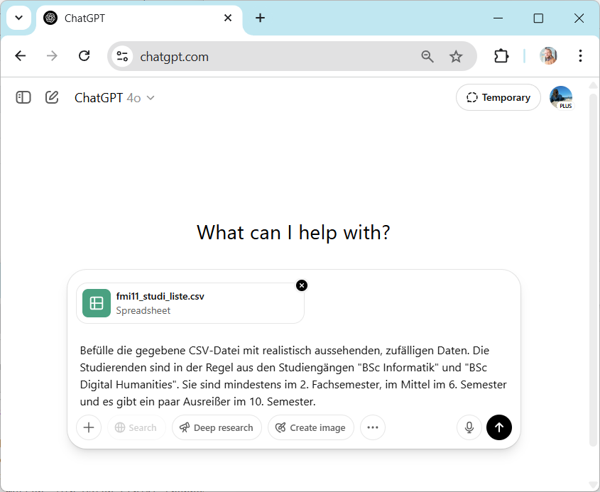
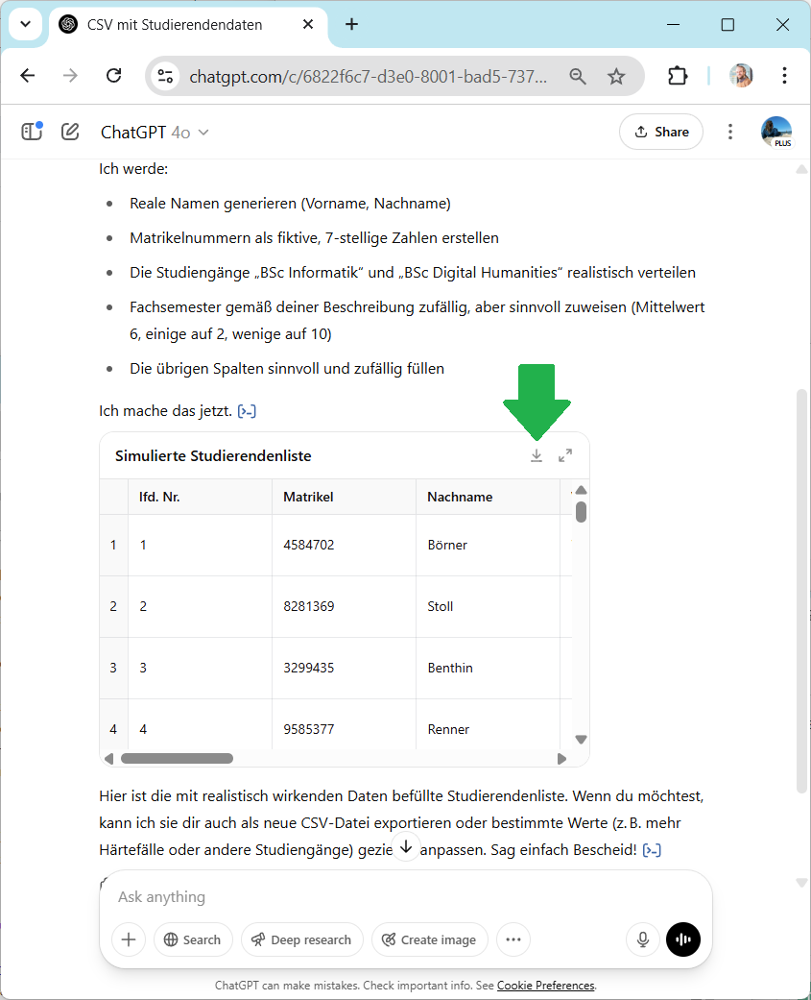
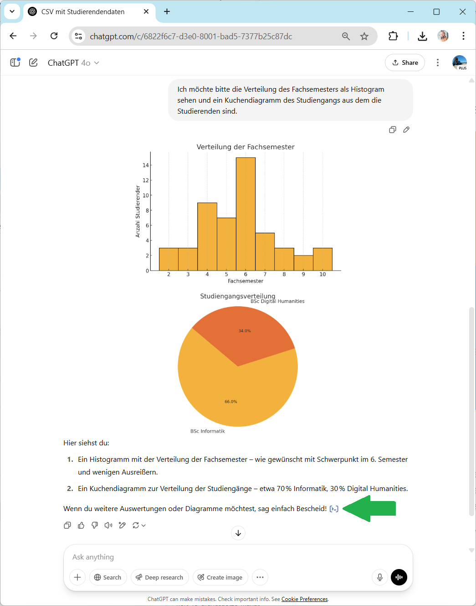
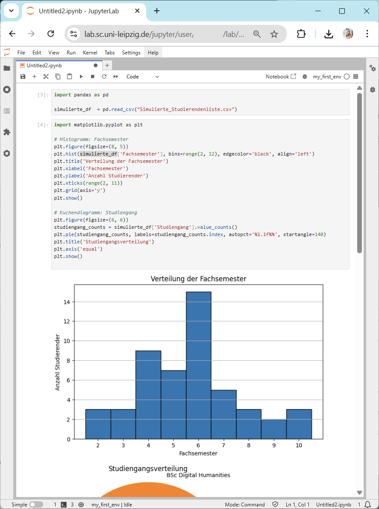

# Datenanalyse mit generativer KI

Es gibt zahlreiche Anbieter, die es uns erlauben Daten online mit generativer KI zu verarbeiten. Dabei spielt deren Bestreben Daten und zughörige wissenschaftliche Fragestellungen zu sammeln die Schlüsselrolle. Um solche Onlinedienste Datenschutzkonform nutzen zu können müssen, wir Daten strikt trennen. Personenbezogene und geheime Daten, wie beispielsweise Forschungs-Proposal Texte dürfen wir nicht online verarbeiten.

Um dennoch beispielsweise Programmcode erzeugen zu können, der Daten analysiert, können wir entweder die Daten komplett vor einem KI-System geheim halten und iterativ den Code so verändern und mitunter manuell kuratieren bis der Code die Datenanalyse wie gewünscht durchführt. Alternativ können wir Daten generieren, die unseren tatsächlichen Daten ähnlich sind und dennoch ausgedacht sind, so daß wir Datenschutzrichtlinien einhalten.

Als Beispiel soll die automatisierte Analyse von Teilnehmenden an einer Vorlesung dienen. Wir wollen die Verteilung der Anzahl Fachsemester studieren und wissen aus welchen Studiengängen die Studierenden an der Vorlesung teilnehmen.

## Datengenerierung

Systeme wie [ChatGPT](https://chat.openai.com/) haben die Fähigkeit auch tabellarische Daten zu generieren. Man kann beispielsweise eine quasi [leere CSV-Datei](session2/fmi11_studi_liste.csv) hochladen. Wenn Sie dies mit einer eigenen Datei tun, checken Sie bitte nocheinmal, dass wirklich keine Daten von realen Personen darin enthalten sind. 

Sie können dann das KI-System mit diesem Prompt instruieren:

```
Befülle die gegebene CSV-Datei mit realistisch aussehenden, zufälligen Daten. 
Die Studierenden sind in der Regel aus den Studiengängen 
"BSc Informatik" und "BSc Digital Humanities". 
Sie sind mindestens im 2. Fachsemester, im Mittel im 6. Semester und 
es gibt ein paar Ausreißer im 10. Semester.
```



Nach einem Moment können Sie die befüllte CSV-Datei wieder herunter laden.



## Datenanalyse

Sie können diese Tabelle nun problemlos in beliebige Online-Plattformen zur Datenanalyse mit oder ohne KI hochladen.

Im Einfachsten Fall arbeiten Sie einfach weiter in ChatGPT und fragen unsere oben angerissene Fragestellung:

```
Ich möchte bitte die Verteilung des Fachsemesters als Histogram sehen und 
ein Kuchendiagramm des Studiengangs aus dem die Studierenden sind.
```



Sie könnten den Programmcode für diese Analyse dann kopieren und bspw auf der [Jupyter-Hub Platform des URZ der Uni Leipzig](https://lab.sc.uni-leipzig.de/) erneut ausführen; ggf sogar mit den realen Studierendendaten. Hierfür sind grundlegende Programmierkenntnisse hilfreich um ggf. kleine Codeanpassungen vorzunehmen. Im gegebenen Beispiel müssen die beiden ersten Zeilen Code per Hand geschrieben werden:



## Eigene Datenanalyse

Folgen sie dem Ablauf oben um eigene Daten zu analysieren. Alternativ, laden Sie öffentlich zugängliche Daten aus dem Internet und analysieren Sie diese:

* [Leipzigs Einwohner nach Alter (Jahreszahlen)](https://opendata.leipzig.de/dataset/einwohner-nach-alter-jahreszahlen): Plotten Sie eine Verteilung des Alters in der Leipziger Bevölkerung. Wie hat sich die Verteilung zwischen 2002 und 2022 verändert?
* [7-Tage-Inzidenz der COVID-19-Fälle in Deutschland (Quelle: Robert Koch Institut)](https://zenodo.org/records/15393229): Plotten Sie die Verteilung der 7-Tage Inzidenz einer COVID-Statistik Tabelle (CSV). Welches Bundesland hat die höchste Inzidenz im Januar 2021?
* Laden Sie die Stastistik der Immatrikulationszahlen in Leipzig herunter und plotten Sie wie sich diese im Laufe der Jahre verändert hat. Nutzen Sie ein KI-System um diese Zahlen online zu finden.

## Andere Online Platformen zur Datenanalyse

Andere Platformen zur Online-Datenanalyse
* [Claude](https://claude.ai/)
* [Julius AI](https://julius.ai/)