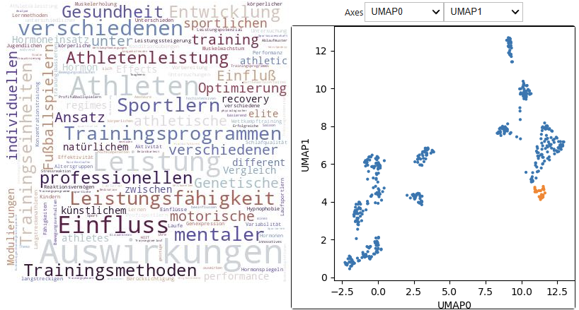
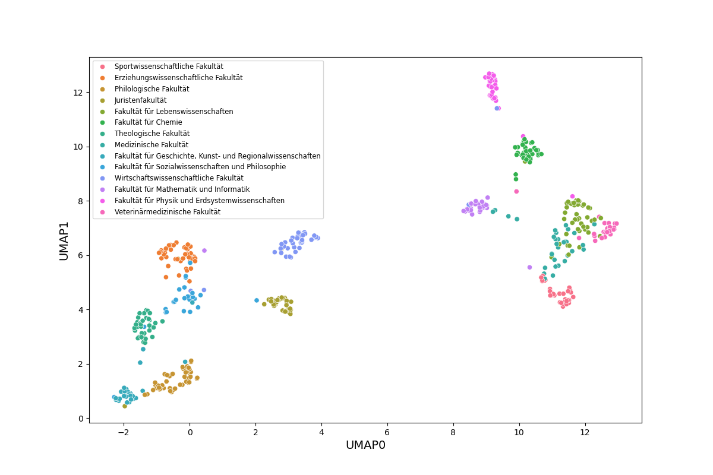
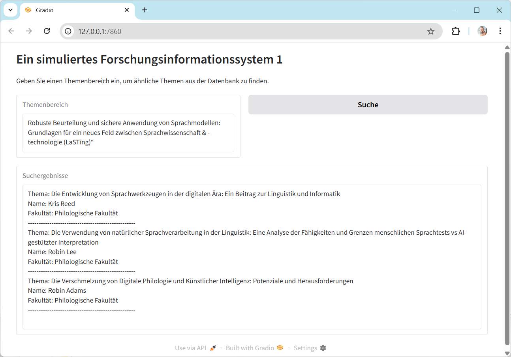
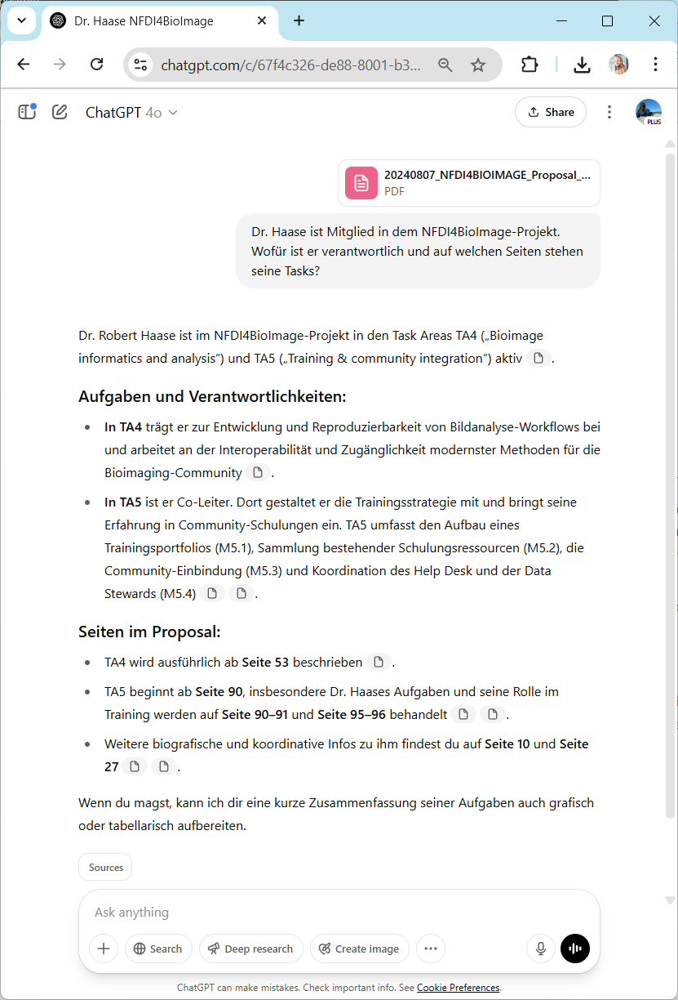
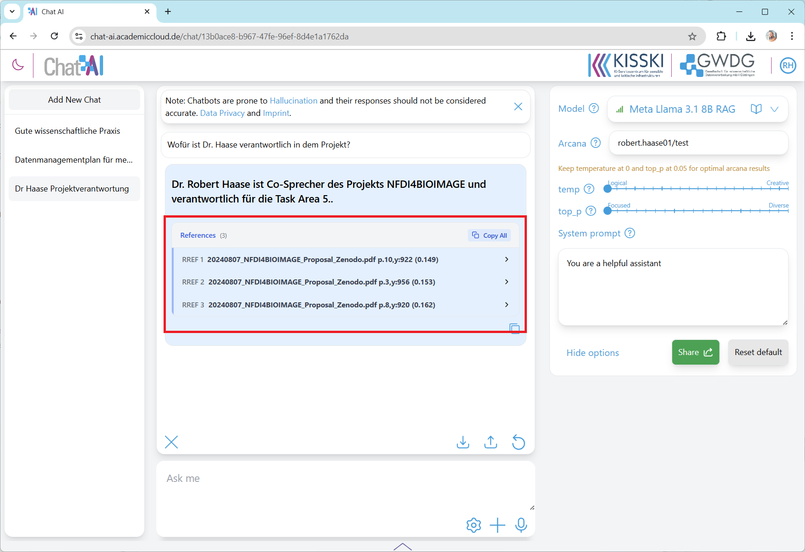

# Spickzettel für Lehrende

In dieser Session werden Teilnehmende Dokumente und Daten analysieren.

## Analyse von Zusammenhängen zwischen Forschungsdisziplinen

Diese Übung wird in der gesamten Gruppe durchgeführt. Wir betrachten einen Plot, in dem jeder Datenpunkt einem Thema einer Doktorarbeit entspricht. 
Der Übungsleiter umrandet einige Punkte, die nah beieinander liegen, um eine Wordcloud aus den Forschungsthemen zu generieren. Die Teilnehmenden raten, um welche Fachdisziplin es sich handelt. Beispiel: Sportwissenschaften:

Nach einigen Wiederholungen sollte sich ein Gefühl einstellen, wie die Datenpunkte mit den dahinterliegenden Daten verknüpft sind. Es vermittelt ein intuitives Verständnis der Funktionsweise von Sprachmodellen.

Hier noch die Auflösung für die Verteilung der Fakultäten:

## Simuliertes Forschungsinformationssystem

Die Teilnehmenden bekommen Zugriff auf drei simulierte Forschungsinformationssysteme, in denen mit LLM-Technologie gesucht werden kann. Ihre Aufgabe ist es, zu ermitteln, welches System zufällige Antworten liefert, welches ein LLM benutzt und welches mit Embeddings arbeitet. Das zufällige System lässt sich einfach ermitteln, da es bei wiederholten Anfragen stark unterschiedliche Antworten liefern wird. Die Relevanz jener Antworten sollte auch sehr klein sein. Die anderen beiden Systeme lassen sich schwieriger unterscheiden. Theoretisch sollte das Embedding-basierte System besser funktionieren und auch schneller antworten. Das LLM-basierte System baut aus der gesamten Datenbank einen sehr langen Prompt, und diesen zu verarbeiten dauert mitunter lange.

Hinweis: Das dahinterliegende Sprachmodell ist OpenAI's GPT-4o-mini. Daher sollten keine personenbezogenen oder geheimen Daten in das Suchfeld eingegeben werden.

## Analyse von Fördermittelanträgen

Eine häufige Anwendung von Sprachmodellen ist eine Kombination mit indizierten Dokumenten. Die zugrundeliegende Technik heißt [Retrieval Augmented Generation, RAG](https://en.wikipedia.org/wiki/Retrieval-augmented_generation).

Beim Vergleich der beiden Systeme (ChatGPT und Arcanas) sollte auffallen, dass ChatGPT ein besseres User-Interface hat, um bspw. Quellenangaben zu machen. Das Arcanas-System ist hingegen so implementiert, dass man es beispielsweise innerhalb der Uni Leipzig installieren könnte und somit Datenschutzkonformität auf höchstem Niveau garantieren _könnte_.

# Datenanalyse mit generativer KI

Diese Übung wird nur Teilnehmenden empfohlen, die grundlegende Programmierkenntnisse in Python haben. 
Gerade bei der Verarbeitung komplexerer Daten könnte auffallen, dass ChatGPT und andere Systeme zwar Code generieren, der auf den ersten Blick plausible Ergebnisse erzeugt, aber im Detail keine korrekte Analyse durchführt.
Im Zweifelsfalle sollte man Datenanalyseexperten hinzuziehen oder direkt in den Chat mit dem KI-System einbinden, wie [hier skizziert](https://www.nature.com/articles/s43588-025-00781-1).

## Bias-Detektion

In dieser Übung nutzen wir eine Chat-App, um Bias in Texten zu identifizieren. Die Teilnehmenden bekommen ein Meetingprotokoll einer fiktiven Sitzung, 
in der drei männliche Teilnehmer ein Symposium planen, bei dem nur Männer Vortragende sind. 
Außerdem ist einer der drei Vortragenden mutmaßlich nicht qualifiziert, über das vorgegebene Thema zu sprechen.

Fragt man ChatGPT, ob in dem Meetingprotokoll problematische Aspekte sind, wird es den Gender-Bias oft nicht erkennen.
Erst wenn man explizit nach Diversität fragt, wird es darauf aufmerksam und kann ggf. auch Verbesserungsvorschläge machen.

## Was lernen wir in dieser Session?

Das Extrahieren von Informationen aus Textdokumenten oder Datenbanken erfordert spezielle technische Vorgehensweisen. 
Gerade wenn Daten zu groß werden, um sie einfach in ChatGPT und Co kopieren zu können, braucht man spezielle technische Systeme. 
Die Auswahl eines solchen Systems ist nicht trivial und erfordert die Betrachtung von mehreren Perspektiven:
* Qualität der Ergebnisse
* Datenschutz
* Kosten
* Benutzerfreundlichkeit

Weiterhin ist Prompt-Engineering oft nicht nur ein iterativer Prozess, sondern auch ein vorwärts- und rückwärtsgerichteter Prozess.
Bevor wir nach Code zur Analyse von Daten fragen können, müssen wir Fake-Daten erzeugen, damit wir die richtige Struktur von Daten in ein Chat-System füttern können.
Wir müssen auch in der Lage sein, Code zu lesen und zu verstehen. Andernfalls laufen wir Gefahr, Daten fehlerhaft zu verarbeiten und die falschen Schlussfolgerungen zu ziehen.
